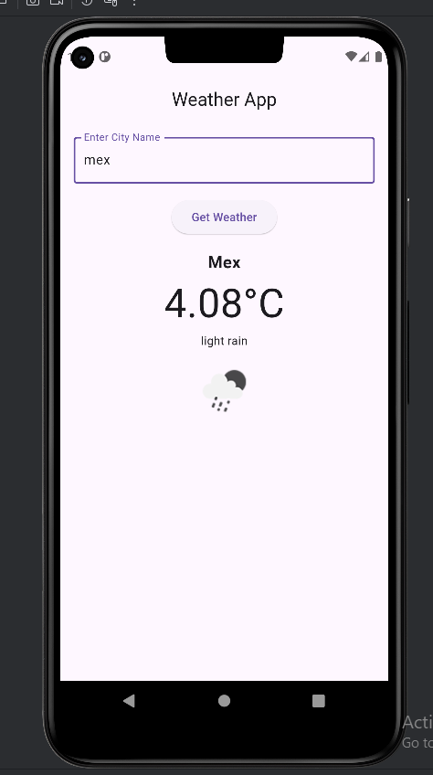
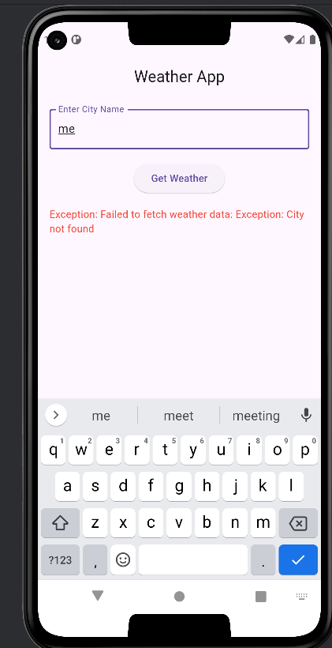

# Weather App 🌦️

A weather application built with Flutter, featuring GetX state management and modular architecture. The app retrieves weather data using the OpenWeatherMap API and displays it with proper error handling.


---

## Requirements 📋

- **Flutter Version**: `3.22.0-36.0.pre.51` (Channel master)

---
## Features ✨

- **Search Weather**: Input a city name to get its current weather.
- **Weather Details**: Displays city name, temperature, description, and weather icon.
- **Error Handling**: Shows user-friendly error messages for invalid city names or network issues.
- **Modular Design**: Clean and scalable project structure.

---

## Project Structure 📂

```plaintext
lib/
├── business/
│   ├── models/
│   │   └── weather.dart             # Data model for weather information
│   ├── repos/
│   │   └── weather_repository.dart  # Repository to handle data transformation
│   └── services/
│       └── weather_service.dart     # API integration layer
├── helpers/
│   ├── app_exceptions.dart          # Custom exceptions for error handling
│   ├── base_controller.dart         # Base controller for GetX
│   └── dialog_helper.dart           # Helper for showing error dialogs
├── modules.weather/
│   ├── widgets/
│   │   ├── weather_item_view.dart                  # Weather item view widget
│   │   ├── weather_page_city_data.dart             # Displays weather info
│   │   ├── weather_page_city_data_error_widget.dart # Error widget
│   │   ├── weather_page_city_text_field.dart       # City input text field
│   │   └── weather_page_get_weather_button.dart    # Button to fetch weather
│   ├── weather_binding.dart          # Dependency injection for Weather Module
│   ├── weather_controller.dart       # GetX controller for Weather Page
│   └── weather_page.dart             # Main UI for weather search
└── main.dart                          # App entry point
```

---

## Screenshots 📸

### Success Screen


### Error Screen


---

## Installation 🚀

1. Clone the repository:
   ```bash
   git clone https://github.com/mhmdelngar/weather-md-labs.git
   cd weather-app
   ```

2. Install dependencies:
   ```bash
   flutter pub get
   ```

3. **No API Key Setup Required**:  
   The project already includes a demo API key for OpenWeatherMap in the `weather_service.dart` file for direct testing.  
   However.

4. Run the app:
   ```bash
   flutter run
   ```


## How It Works ⚙️

1. **Input**: User enters the name of a city.
2. **API Call**: The app fetches weather data from OpenWeatherMap API.
3. **Data Parsing**: Extracts temperature, description, and weather icon from the response.
4. **UI Update**: Displays the weather or shows an error message for issues.

---

## Dependencies 🛠️

- [GetX](https://pub.dev/packages/get) - State management and routing
- [http](https://pub.dev/packages/http) - Networking library
- [Flutter](https://flutter.dev) - Cross-platform framework

---
